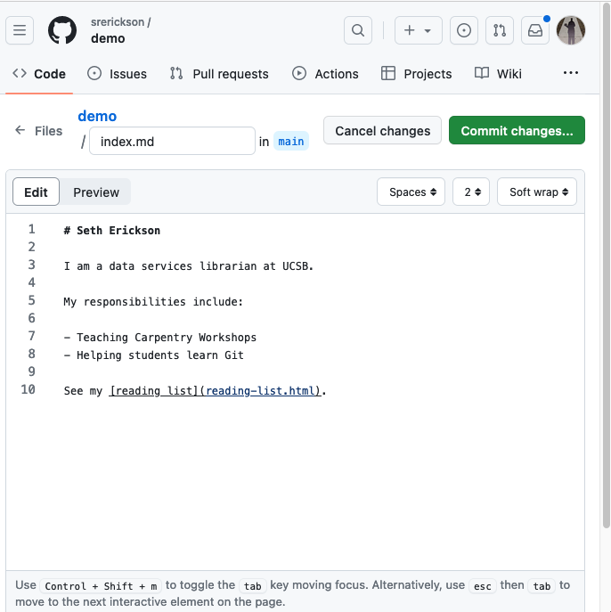

As soon as people can work in parallel, they'll likely step on each other's
toes. This will even happen with a single person: if we are working on a piece
of software on both our laptop and a server in the lab, we could make different
changes to each copy.  Version control helps us manage these [conflicts]({{
page.root}}#conflict) by giving us tools to [resolve]({{
page.root }}#resolve) overlapping changes.

To see how we can resolve conflicts, we must first create one. The file
`index.md` currently looks something like this on both your computer and your
GitHub repository:

~~~
# Seth Erickson

I am a data services librarian at UCSB.

My responsibilities include:

- Teaching Carpentry Workshops
- Helping students learn Git

See my [reading list](reading-list.html).
~~~
{: .output}

What if you make changes to the file directly through GitHub. From the main page
for the repo, click on `index.md` in the file list, then click on the pencil icon
to edit the file.

Make a change on the first line of the file and then click "Commit". Now make a
different change to your *local* copy of the file, without.

~~~
$ nano index.md
$ git add index.md
$ git commit -m "another change"
~~~
{: .language-bash}

At this point, your local repository and the repository on GitHub have *diverged*: HEAD
refers to a different commit for each. This is is the making a of a conflict. 

What happens when we try to `push` our repository to GitHub?

~~~
$ git push origin main
~~~
{: .language-bash}

~~~
To https://github.com/user/simple-site.git
 ! [rejected]        main -> main (fetch first)
error: failed to push some refs to 'https://github.com/user/simple-site.git'
hint: Updates were rejected because the remote contains work that you do
hint: not have locally. This is usually caused by another repository pushing
hint: to the same ref. You may want to first integrate the remote changes
hint: (e.g., 'git pull ...') before pushing again.
hint: See the 'Note about fast-forwards' in 'git push --help' for details.
~~~
{: .output}

Git rejects the push because it detects that the remote repository has new
updates that have not been incorporated into the local branch. What we have to
do is pull the changes from GitHub, [merge]({{ page.root }}#merge) them into the copy we're currently working in, and then push that.
Let's start by pulling:

~~~
$ git pull origin main
~~~
{: .language-bash}

~~~
remote: Enumerating objects: 5, done.
remote: Counting objects: 100% (5/5), done.
remote: Compressing objects: 100% (1/1), done.
remote: Total 3 (delta 2), reused 3 (delta 2), pack-reused 0
Unpacking objects: 100% (3/3), done.
From https://github.com/user/simple-site
 * branch            main     -> FETCH_HEAD
    29aba7c..dabb4c8  main     -> origin/main
Auto-merging index.md
CONFLICT (content): Merge conflict in index.md
Automatic merge failed; fix conflicts and then commit the result.
~~~
{: .output}

> ## Configuring how Git reconcile divergent branches
> When you run `git pull` on a diverged branch for the first time, you may see
> an error message like this:
> ~~~
> $ git pull origin main
> ~~~
> {: .language-bash}
> 
> ~~~
> hint: You have divergent branches and need to specify how to reconcile them.
> hint: You can do so by running one of the following commands sometime before
> hint: your next pull:
> hint: 
> hint:   git config pull.rebase false  # merge
> hint:   git config pull.rebase true   # rebase
> hint:   git config pull.ff only       # fast-forward only
> hint: 
> hint: You can replace "git config" with "git config --global" to set a default
> hint: preference for all repositories. You can also pass --rebase, --no-rebase,
> hint: or --ff-only on the command line to override the configured default per
> hint: invocation.
> fatal: Need to specify how to reconcile divergent branches.
> ~~~
> For this lesson, we'll use the historical default option: `pull.rebase false`. 
> ~~~
> $ git config pull.rebase false
> ~~~
> {: .language-bash}
{: .callout}

The `git pull` command updates the local repository to include those changes
already included in the remote repository. After the changes from remote branch
have been fetched, Git detects that changes made to the local copy overlap with
those made to the remote repository, and therefore refuses to merge the two
versions to stop us from trampling on our previous work. The conflict is marked
in in the affected file:

~~~
$ cat index.md
~~~
{: .language-bash}

~~~
<<<<<<< HEAD
## Seth Erickson
=======
# Jon Jablonski

I am the Director of the DREAM Lab

# Seth Erickson
>>>>>>> 004b4d5f9a599a92d6a19c5c82a362d8126f4403

I am a data services librarian at UCSB.

My responsibilities include:

- Teaching Carpentry Workshops
- Helping students learn Git

See my [reading list](reading-list.html).
~~~
{: .output}

Our change is preceded by `<<<<<<< HEAD`.
Git has then inserted `=======` as a separator between the conflicting changes
and marked the end of the content downloaded from GitHub with `>>>>>>>`.
(The string of letters and digits after that marker
identifies the commit we've just downloaded.)

It is now up to us to edit this file to remove these markers
and reconcile the changes.
We can do anything we want: keep the change made in the local repository, keep
the change made in the remote repository, write something new to replace both,
or get rid of the change entirely.
Let's replace both so that the file looks like this:

~~~
$ cat index.md
~~~
{: .language-bash}

~~~
## Jon Jablonski

I am the Director of the DREAM Lab

## Seth Erickson

I am a data services librarian at UCSB.

My responsibilities include:

- Teaching Carpentry Workshops
- Helping students learn Git

See my [reading list](reading-list.html).
~~~
{: .output}

To finish merging,
we add `index.md` to the changes being made by the merge
and then commit:

~~~
$ git add index.md
$ git status
~~~
{: .language-bash}

~~~
On branch main
All conflicts fixed but you are still merging.
  (use "git commit" to conclude merge)

Changes to be committed:

	modified:   index.md

~~~
{: .output}

~~~
$ git commit -m "Merge changes from GitHub"
~~~
{: .language-bash}

~~~
[main 2abf2b1] Merge changes from GitHub
~~~
{: .output}

Now we can push our changes to GitHub:

~~~
$ git push origin main
~~~
{: .language-bash}

~~~
Enumerating objects: 10, done.
Counting objects: 100% (10/10), done.
Delta compression using up to 8 threads
Compressing objects: 100% (6/6), done.
Writing objects: 100% (6/6), 645 bytes | 645.00 KiB/s, done.
Total 6 (delta 4), reused 0 (delta 0)
remote: Resolving deltas: 100% (4/4), completed with 2 local objects.
To https://github.com/user/simple-site.git
   dabb4c8..2abf2b1  main -> main
~~~
{: .output}

Git keeps track of what we've merged with what,
so we don't have to fix things by hand again
when the collaborator who made the first change pulls again:

~~~
$ git pull origin main
~~~
{: .language-bash}

~~~
remote: Enumerating objects: 10, done.
remote: Counting objects: 100% (10/10), done.
remote: Compressing objects: 100% (2/2), done.
remote: Total 6 (delta 4), reused 6 (delta 4), pack-reused 0
Unpacking objects: 100% (6/6), done.
From https://github.com/user/simple-site
 * branch            main     -> FETCH_HEAD
    dabb4c8..2abf2b1  main     -> origin/main
Updating dabb4c8..2abf2b1
Fast-forward
 index.md | 2 +-
 1 file changed, 1 insertion(+), 1 deletion(-)
~~~
{: .output}

We get the merged file:

~~~
$ cat index.md
~~~
{: .language-bash}

~~~
## Jon Jablonski

I am the Director of the DREAM Lab

## Seth Erickson

I am a data services librarian at UCSB.

My responsibilities include:

- Teaching Carpentry Workshops
- Helping students learn Git

See my [reading list](reading-list.html).
~~~
{: .output}

We don't need to merge again because Git knows someone has already done that.

Git's ability to resolve conflicts is very useful, but conflict resolution
costs time and effort, and can introduce errors if conflicts are not resolved
correctly. If you find yourself resolving a lot of conflicts in a project,
consider these technical approaches to reducing them:

- Pull from upstream more frequently, especially before starting new work
- Use topic branches to segregate work, merging to main when complete
- Make smaller more atomic commits
- Where logically appropriate, break large files into smaller ones so that it is
  less likely that two authors will alter the same file simultaneously

Conflicts can also be minimized with project management strategies:

- Clarify who is responsible for what areas with your collaborators
- Discuss what order tasks should be carried out in with your collaborators so
  that tasks expected to change the same lines won't be worked on simultaneously
- If the conflicts are stylistic churn (e.g. tabs vs. spaces), establish a
  project convention that is governing and use code style tools (e.g.
  `htmltidy`, `perltidy`, `rubocop`, etc.) to enforce, if necessary

> ## Advanced Git: Resolving without a merge commit 
> 
> Use `git pull --rebase` instead of `git pull`. 
> If the remote has diverged from local and automerge doesn't work, git rebase will ask you to resolve the conflict (same as git pull); you then `git add` the files with resolved conflict and `git rebase --continue` (instead of `git commit`). 
> The end result is that your local changes are applied after the commits retrieved from the remote. 
> A tidy sequence of commits, without a merge commit. After `git rebase --continue` , you push back to the remote.
> {: .source}
{: .callout}

> ## Solving Conflicts that You Create
>
> Clone the repository created by your instructor.
> Add a new file to it,
> and modify an existing file (your instructor will tell you which one).
> When asked by your instructor,
> pull her changes from the repository to create a conflict,
> then resolve it.
{: .challenge}

> ## Conflicts on Non-textual files
>
> What does Git do
> when there is a conflict in an image or some other non-textual file
> that is stored in version control?
>
> > ## Solution
> >
> > Let's try it. Suppose We takes a picture and
> > calls it example files, `ex-files.jpg`.
> >
> > If you do not have an image file of ex-files available, you can create
> > a dummy binary file like this:
> >
> > ~~~
> > $ head -c 1024 /dev/urandom > ex-files.jpg
> > $ ls -lh ex-files.jpg
> > ~~~
> > {: .language-bash}
> >
> > ~~~
> > -rw-r--r-- 1 user 57095 1.0K Mar  8 20:24 ex-files.jpg
> > ~~~
> > {: .output}
> >
> > `ls` shows us that this created a 1-kilobyte file. It is full of
> > random bytes read from the special file, `/dev/urandom`.
> >
> > Now, suppose we add `ex-files.jpg` to our repository:
> >
> > ~~~
> > $ git add ex-files.jpg
> > $ git commit -m "Add picture of Martian surface"
> > ~~~
> > {: .language-bash}
> >
> > ~~~
> > [main 8e4115c] Add picture of Martian surface
> >  1 file changed, 0 insertions(+), 0 deletions(-)
> >  create mode 100644 ex-files.jpg
> > ~~~
> > {: .output}
> >
> > Suppose that our collaborator has added a similar picture in the meantime.
> > Theirs is a picture of the Martian sky, but it is *also* called `ex-files.jpg`.
> > When We tried to push, they gets a familiar message:
> >
> > ~~~
> > $ git push origin main
> > ~~~
> > {: .language-bash}
> >
> > ~~~
> > To https://github.com/user/simple-site.git
> >  ! [rejected]        main -> main (fetch first)
> > error: failed to push some refs to 'https://github.com/user/simple-site.git'
> > hint: Updates were rejected because the remote contains work that you do
> > hint: not have locally. This is usually caused by another repository pushing
> > hint: to the same ref. You may want to first integrate the remote changes
> > hint: (e.g., 'git pull ...') before pushing again.
> > hint: See the 'Note about fast-forwards' in 'git push --help' for details.
> > ~~~
> > {: .output}
> >
> > We've learned that we must pull first and resolve any conflicts:
> >
> > ~~~
> > $ git pull origin main
> > ~~~
> > {: .language-bash}
> >
> > When there is a conflict on an image or other binary file, git prints
> > a message like this:
> >
> > ~~~
> > $ git pull origin main
> > remote: Counting objects: 3, done.
> > remote: Compressing objects: 100% (3/3), done.
> > remote: Total 3 (delta 0), reused 0 (delta 0)
> > Unpacking objects: 100% (3/3), done.
> > From https://github.com/user/simple-site.git
> >  * branch            main     -> FETCH_HEAD
> >    6a67967..439dc8c  main     -> origin/main
> > warning: Cannot merge binary files: ex-files.jpg (HEAD vs. 439dc8c08869c342438f6dc4a2b615b05b93c76e)
> > Auto-merging ex-files.jpg
> > CONFLICT (add/add): Merge conflict in ex-files.jpg
> > Automatic merge failed; fix conflicts and then commit the result.
> > ~~~
> > {: .output}
> >
> > The conflict message here is mostly the same as it was for `index.md`, but
> > there is one key additional line:
> >
> > ~~~
> > warning: Cannot merge binary files: ex-files.jpg (HEAD vs. 439dc8c08869c342438f6dc4a2b615b05b93c76e)
> > ~~~
> > {: .output}
> >
> > Git cannot automatically insert conflict markers into an image as it does
> > for text files. So, instead of editing the image file, we must check out
> > the version we want to keep. Then we can add and commit this version.
> >
> > On the key line above, Git has conveniently given us commit identifiers
> > for the two versions of `ex-files.jpg`. Our version is `HEAD`, and their
> > version is `439dc8c0...`. If we want to use our version, we can use
> > `git checkout`:
> >
> > ~~~
> > $ git checkout HEAD ex-files.jpg
> > $ git add ex-files.jpg
> > $ git commit -m "Use image of surface instead of sky"
> > ~~~
> > {: .language-bash}
> >
> > ~~~
> > [main 21032c3] Use image of surface instead of sky
> > ~~~
> > {: .output}
> >
> > If instead we want to use their version, we can use `git checkout` with
> > their commit identifier, `439dc8c0`:
> >
> > ~~~
> > $ git checkout 439dc8c0 ex-files.jpg
> > $ git add ex-files.jpg
> > $ git commit -m "Use image of sky instead of surface"
> > ~~~
> > {: .language-bash}
> >
> > ~~~
> > [main da21b34] Use image of sky instead of surface
> > ~~~
> > {: .output}
> >
> > We can also keep *both* images. The catch is that we cannot keep them
> > under the same name. But, we can check out each version in succession
> > and *rename* it, then add the renamed versions. First, check out each
> > image and rename it:
> >
> > ~~~
> > $ git checkout HEAD ex-files.jpg
> > $ git mv ex-files.jpg ex-files02.jpg
> > $ git checkout 439dc8c0 ex-files.jpg
> > $ mv ex-files.jpg ex-files01.jpg
> > ~~~
> > {: .language-bash}
> >
> > Then, remove the old `ex-files.jpg` and add the two new files:
> >
> > ~~~
> > $ git rm ex-files.jpg
> > $ git add ex-files02.jpg
> > $ git add ex-files01.jpg
> > $ git commit -m "Use two images: surface and sky"
> > ~~~
> > {: .language-bash}
> >
> > ~~~
> > [main 94ae08c] Use two images: surface and sky
> >  2 files changed, 0 insertions(+), 0 deletions(-)
> >  create mode 100644 ex-files01.jpg
> >  rename ex-files.jpg => ex-files02.jpg (100%)
> > ~~~
> > {: .output}
> >
> > Now both images of ex-files are checked into the repository, and `ex-files.jpg`
> > no longer exists.
> {: .solution}
{: .challenge}

